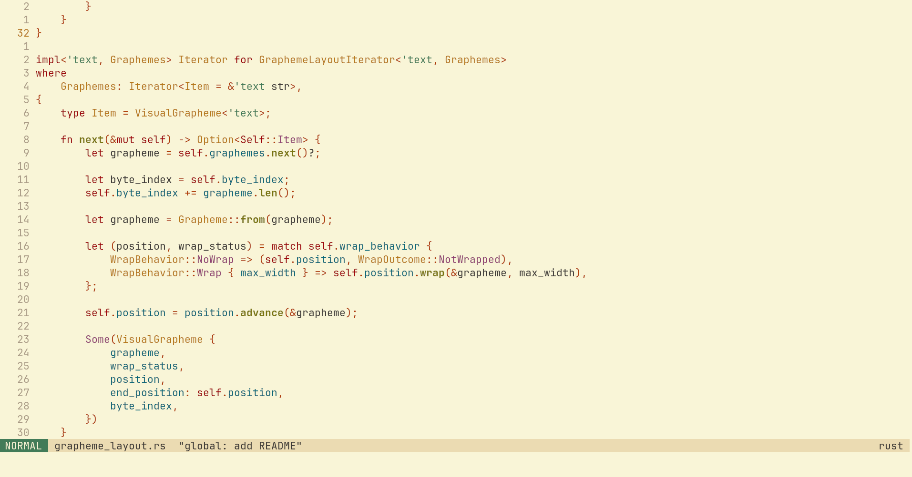
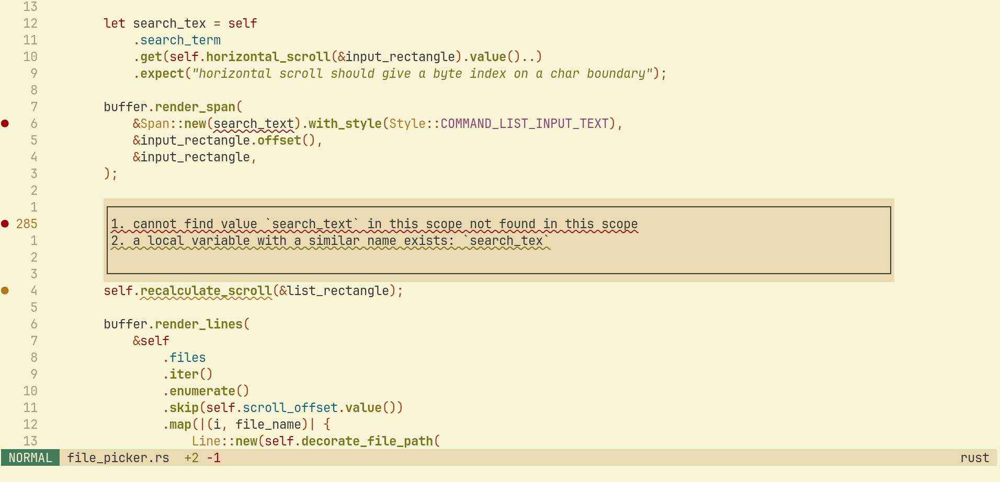
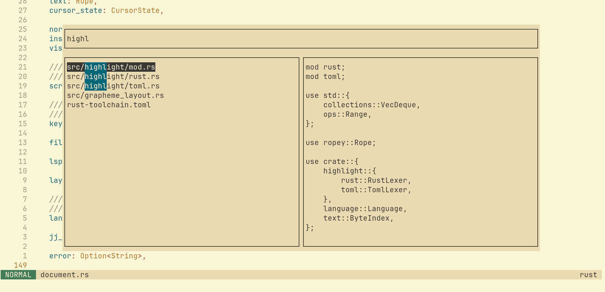

# Iron

Iron is a WIP terminal text editor written in Rust. It is entirely geared towards my needs, and is not designed with any general user in mind. For example:

- no config at all: keybindings and themes are statically defined in the code (it's possible I may make this dynamic in future, but not in order to make Iron configurable)
- only integrates with jj, not git
- will only have LSP and formatting features that I use

The main purposes of this project are twofold:

- as a "playground" for recreational programming, testing new programming concepts/ideas, etc.
- to eventually be my main code editor

Most of the code is hand-written. This is not out of any kind of anti-LLM principle (and indeed there is some LLM-generated code: `jj log -r 'description(substring:AI-generated)'`) but rather because it doesn't really jibe with the point of this project. I do generate and throw away a fair amount of code to test the capabilities of new models, also.

## Features

Iron isn't "usable" yet. It has a fair amount implemented though, some of which is described below.

### Vim motions

I'm adding the Vim motions that I care about only. I haven't done them all yet, but I've got most of the "core" motions implemented. I do think that theoretically the Helix/Kakoune motion style of `select -> action` is better than Vim's `action -> select` so I may move to that in the future if I can be bothered to put the time into adjusting my muscle memory.

### Syntax highlighting

https://github.com/user-attachments/assets/251b4675-df06-4111-b154-60289d28754a

Iron has rudimentary syntax highlighting for some languages (at the time of writing: Rust and TOML). I'm not using tree-sitter; instead, I've implemented my own highlighter using something partway between a lexer and a parser. This is because my requirements for highlighting are:

- file size makes no difference to highlighting performance
- highlights don't slow down the editor
- not a massive memory hog

I care less about 100% correct highlights, tracking variable names for consistent colouring, etc. to which an incremental parser like tree-sitter is much more well-suited.

The actual machinery around the highlighter has undergone the most iteration and I'm still not completely happy with it. The way it currently works is:

1. on a separate thread, highlight "checkpoints" are calculated by getting the highlight tokens and keeping the positions of the ones that are "significant", i.e. it's probably safe to begin highlighting from here on the main thread
2. on the main render thread, we start from the nearest checkpoint before the viewport if it exists or, if not, simply the first byte of the viewport
3. on text edits, the highlight checkpoints are re-calculated

This works reasonably well, but there's a lot of "wasted" CPU work in the sense that, when calculating checkpoints, we still run the full highlighting code, then discard most of the tokens. Also, the checkpoints aren't chunked or versioned. I'll be fixing most/all of this eventually, but it's only really a problem "in practice" for very large files.

The highlighting isn't perfect, but it was very satisfying to get something working.

### LSP

Iron has LSP communication set up; currently only [`rust-analyzer`](https://rust-analyzer.github.io/) is supported and it only has capability to display diagnostics at the moment. The LSP implementation is pretty barebones. For example, if we encounter a fatal error, we just kill the server without attempting to restart it. I'll be adding support for the most useful LSP operations such as code actions, renames, go-to definition. 

### File Picker

The file picker is powered by [fff](https://github.com/dmtrKovalenko/fff). The crate is doing most of the complicated stuff -- indexing files, fuzzy search implementation, etc. -- and then Iron is just concerned with the interface.
